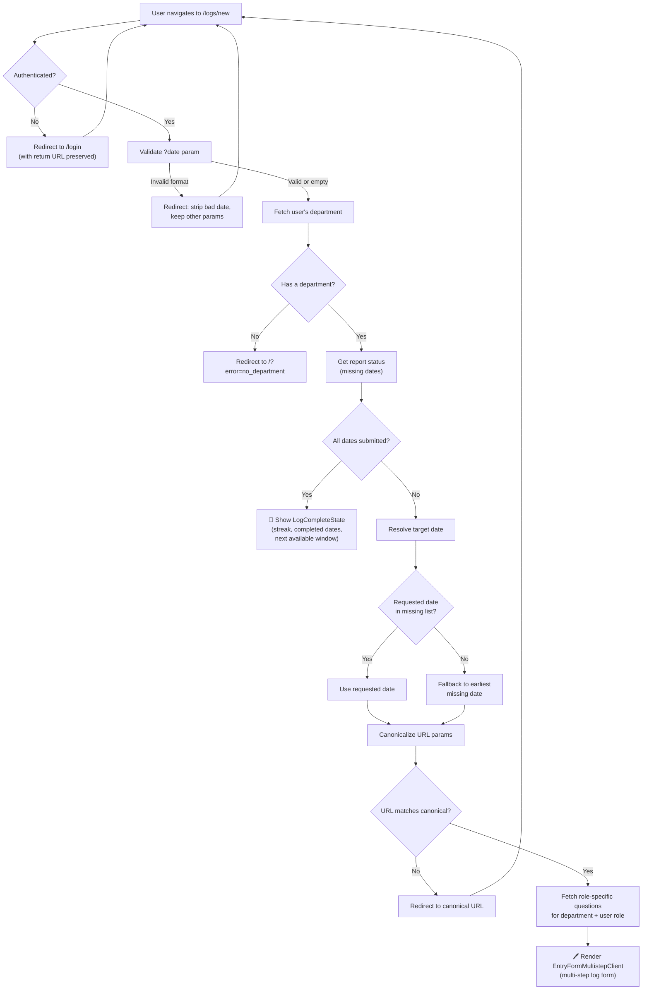

# New Log Page (`app/logs/new/page.tsx`) — Analysis

## Purpose

This page is a **daily accountability check-in system**. Team members in a department answer role-specific questions about their day/work. The backfill logic and streak gamification make the goal clear: **consistent, daily reporting without gaps**.

It's less of a "create when you want" form and more of a **"you owe us a log for these dates"** enforcer.

> [!NOTE]
> Each user belongs to **exactly one** department.

---

## Possible Use Cases

### 1. Creating a New Daily Log Entry
The primary use case — an authenticated user navigates here to submit a new log/report for a specific date. The page renders a multi-step form (`EntryFormMultistepClient`) pre-populated with role-specific questions.

### 2. Date-Specific Log Submission
Via the `?date=YYYY-MM-DD` query param, users (or the app) can deep-link to create a log for a **specific past date**. The page validates the date format, rejects future dates, and checks if that date still needs a log.

### 3. Backfill / Catch-Up on Missed Logs
The `reportStatus.missingDates` logic identifies dates the user hasn't submitted logs for yet. If the requested date isn't missing, the page auto-redirects to the **earliest missing date**, enabling a catch-up workflow.

### 4. Template-Based Log Creation
The `?template=...` param is forwarded to `EntryFormMultistepClient`, supporting pre-filling the form from a saved or predefined template (e.g., a recurring entry pattern).

### 5. "All Caught Up" / Completion State Display
When `reportStatus.isFullySubmitted` is `true`, the page renders `LogCompleteState` instead of the form — showing the user their streak, completed dates, and when the next log window opens. This doubles as a **gamification/motivation screen**.

### 6. Role-Aware Question Rendering
The page fetches **role-specific questions** (`fetchRoleQuestions`) based on the user's department role (e.g., `member`, `lead`). Different roles see different form fields, enabling **role-based data collection**.

### 7. Unauthenticated Redirect with Return URL
If the user isn't logged in, they're redirected to `/login` with a `?redirect=` param preserving all query params. After login, they're sent back to this exact page — a standard **protected page with return-to** pattern.

### 8. Authorization Enforcement
Users without any department assignment are redirected to `/?error=no_department`. This serves as an **access control boundary**.

---

## Current User Journey

### Step-by-Step Narrative

| Step | What Happens |
|------|-------------|
| **1. Access** | User hits `/logs/new`, optionally with `?date=` and `?template=` |
| **2. Auth check** | If not logged in → redirected to `/login` with a return URL so they come back after login |
| **3. Date validation** | If a `?date` param is present, it must be `YYYY-MM-DD` format and not in the future. Invalid → stripped and redirected |
| **4. Department fetch** | Fetches the user's single department. If none → error redirect |
| **5. Report status check** | Checks which dates still need logs. If **all submitted** → shows the **completion/streak screen** with congrats, streak count, and countdown to next available date |
| **6. Date resolution** | If the requested date is in the "missing" list, use it. Otherwise fall back to the **earliest missing date** (backfill-first approach) |
| **7. URL canonicalization** | Ensures the URL has the resolved `date`. If not → redirect to the canonical URL |
| **8. Question loading** | Fetches **role-specific questions** — both department-wide and role-scoped |
| **9. Form render** | Renders `EntryFormMultistepClient` with: user ID, department, date, allowed dates, role questions, and optional template |

### Two Possible End States

1. **✅ Form** — User fills out the multi-step log entry form with role-appropriate questions
2. **🎉 Completion screen** — User has submitted all required logs; sees streak and next-available countdown

---

## Identified Gaps

### Functional Gaps

| Gap | Impact |
|-----|--------|
| **No draft/auto-save** | Multi-step form — if the user navigates away or loses connection, all progress is lost |
| **No edit path** | Once submitted, there's no way back. Users who make mistakes have no recourse from this page |
| **No post-submission flow** | The page handles everything *before* submission but doesn't define what happens *after*. Where does the user land? |
| **No holiday/leave awareness** | `missingDates` treats every date equally. If the user was on leave, they're still nagged to backfill those days |
| **No urgency signaling** | Doesn't communicate *how many* logs are overdue or *how old* the oldest gap is before dumping the user into a form |
| **Backfill-first forced** | Always redirects to the earliest missing date. If a user has 10 missing days, they *must* start from the oldest. No way to say "I want to log just for today" without filling the gaps first. This could frustrate users and discourage logging |
| **No skip/defer option** | If a user can't fill a backfill date (they don't remember), there's no "skip this date" or "mark as N/A" |
| **Completion screen is a dead end** | `LogCompleteState` shows streak info but offers no clear next action (go to dashboard? view past logs?) |

### Technical Gaps

| Gap | Impact |
|-----|--------|
| **Timezone bug** | `new Date().toISOString().split("T")[0]` uses **UTC**, not the user's local timezone (despite the comment saying "user's local timezone"). A user at UTC+3 at 1:00 AM would get yesterday's date |
| **No loading/error UI** | Server component does all fetching — if Supabase is slow or errors, the user sees nothing meaningful |
| **No `Suspense` boundary** | Multiple `await` calls happen serially (department → report status → questions). Could be parallelized, and should have a loading skeleton |
| ~~**Over-engineered department logic**~~ | ✅ **Fixed** — simplified to single-department `.single()` query |

### UX Gaps

| Gap | Impact |
|-----|--------|
| **No contextual header** | The page jumps straight into a form. No server-rendered heading like "Logging for [Department] on [Date]" |
| ~~**`?departmentId` param is misleading**~~ | ✅ **Fixed** — removed from URL params |
